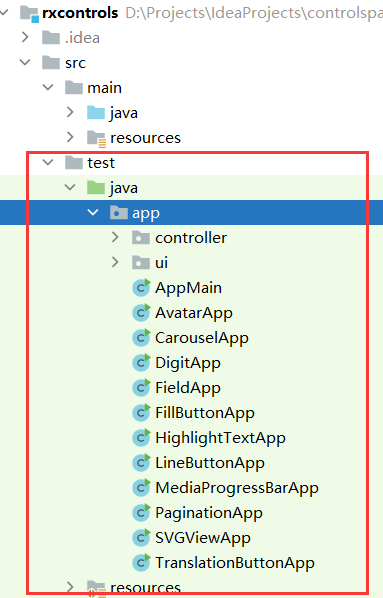
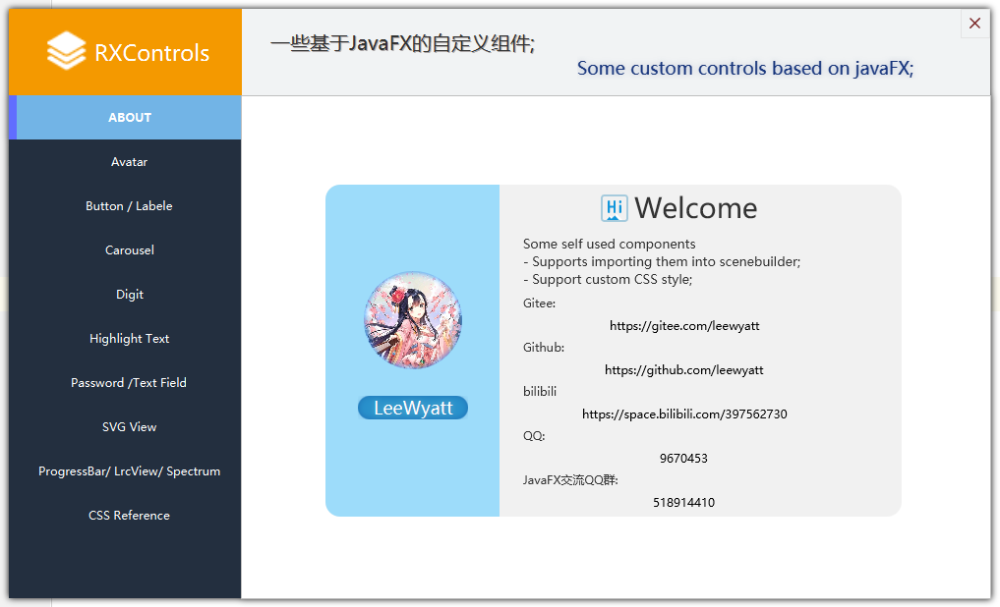
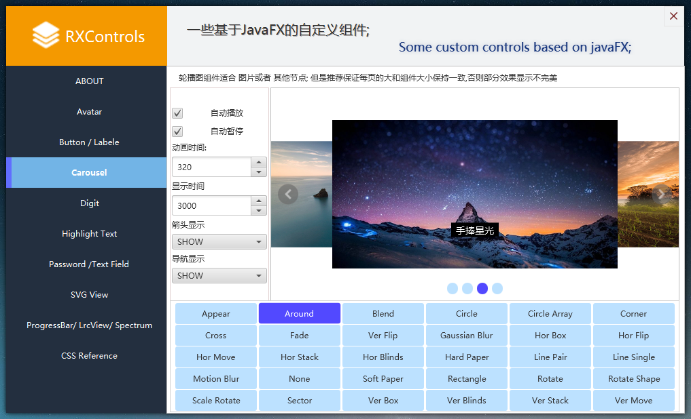
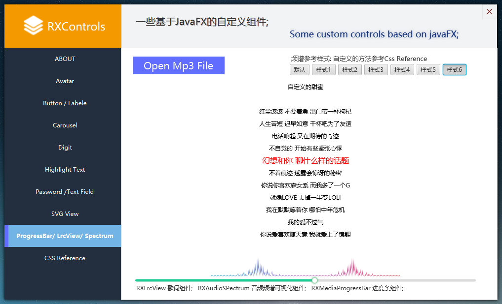
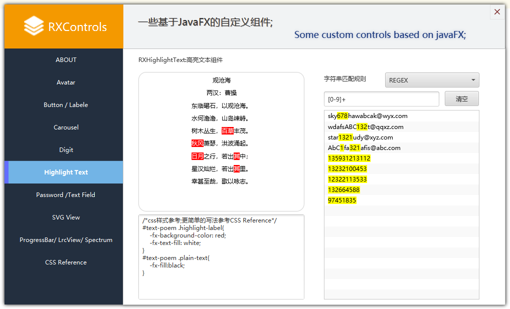
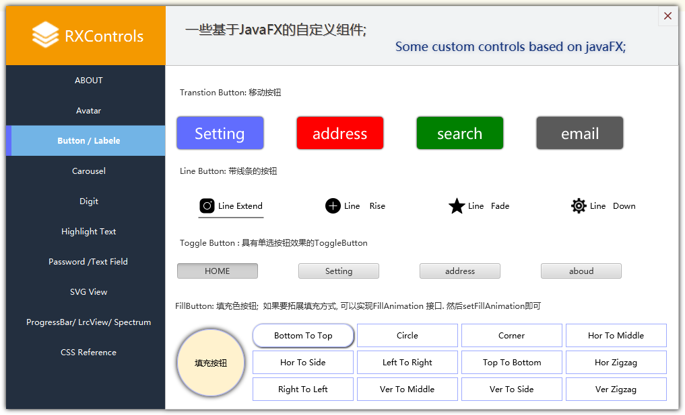

## RXControls 

- RXControls Version 8.x.y need javafx8
- RXControls Version 11.x.y need javafx11+


一个javafx的自定义组件库, 密码可见组件, 轮播图组件, 动态按钮组件等, 音频频谱可视化组件,歌词组件 等... <br />

 Javafx custom component library, password visible component, carousel component, dynamic button component,spectrum component,lyrics component etc...  <br />

>QQ:  **9670453**  <br />
JavaFX QQ群: **518914410** <br/>

Maven dependency
```xml
    <repositories>
        <repository>
            <id>jitpack.io</id>
            <url>https://jitpack.io</url>
        </repository>
    </repositories>

    <dependencies>
        <dependency>
            <groupId>com.github.leewyatt</groupId>
            <artifactId>rxcontrols</artifactId>
            <!-- 11.x.y -->
            <version>11.0.2</version>
        </dependency>
    </dependencies>
```

- Carousel & FillButton inspired by [Gleidson28](https://github.com/Gleidson28)
- Soft Page Transition inspired by [Yuichi.Sakuraba](https://gist.github.com/skrb/1c62b77ef7ddb3c7adf4)
- Carousel inspired by [Swiper中文网](https://www.swiper.com.cn/)
> Demos in the test directory.






