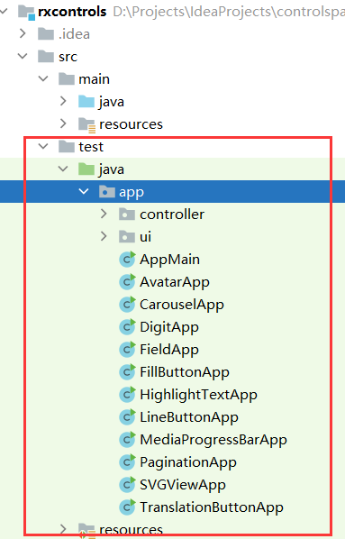
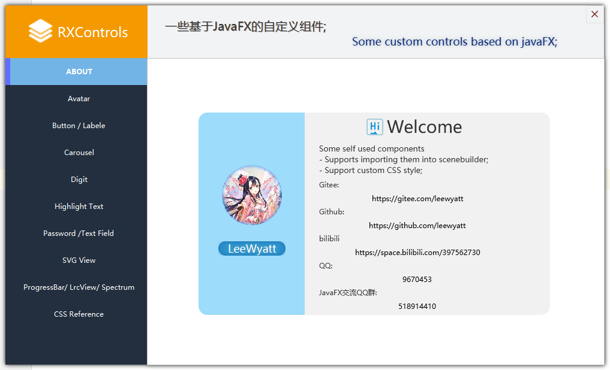
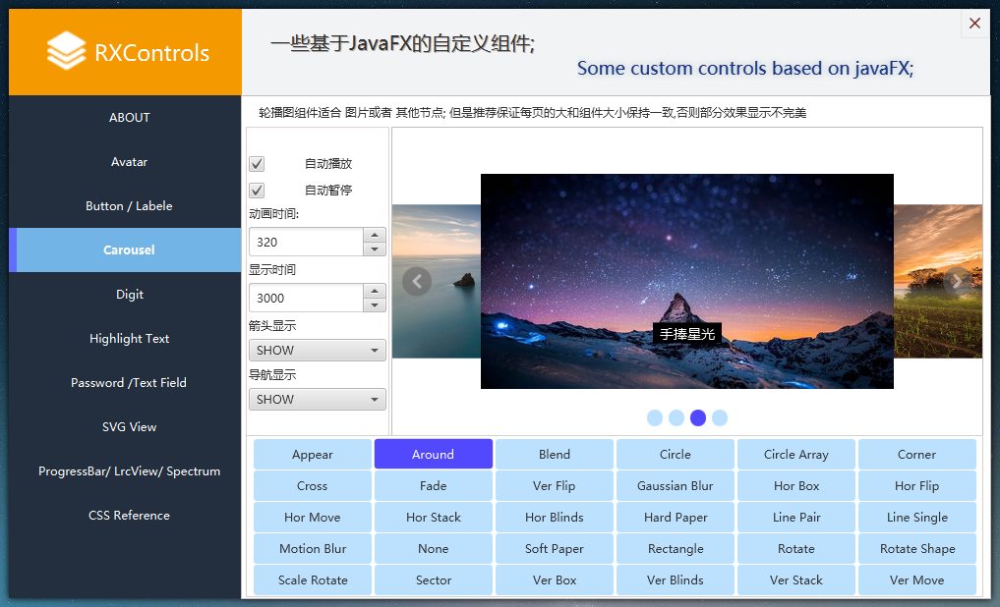
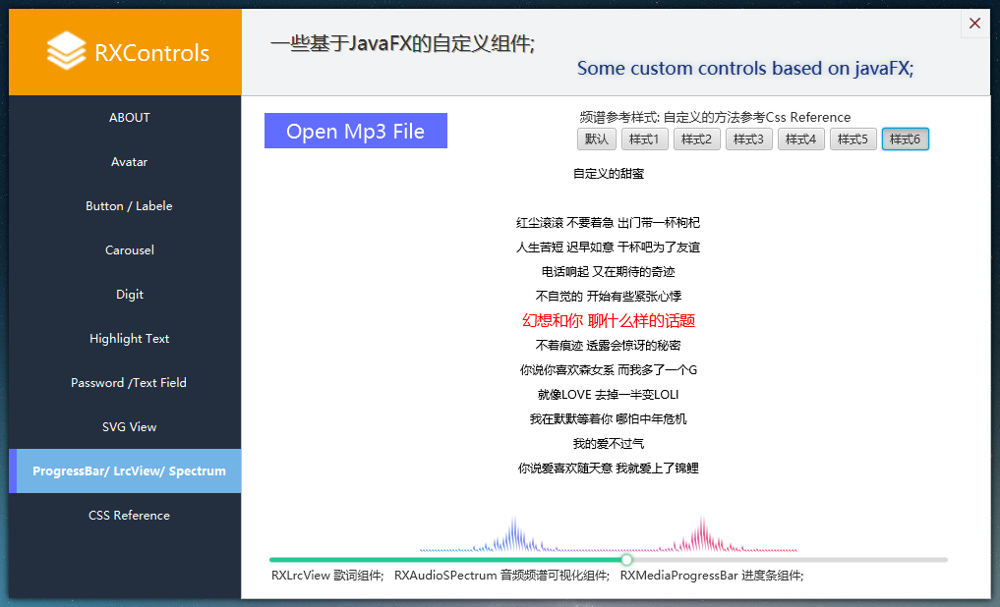
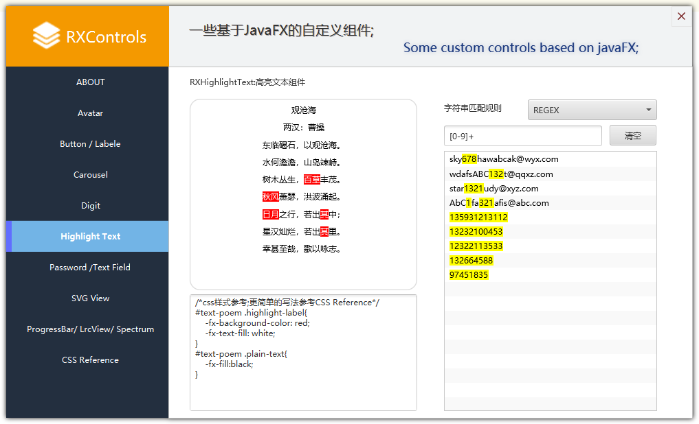
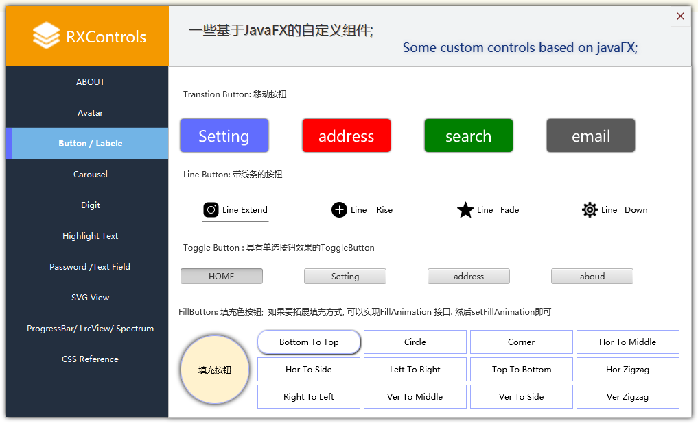

## RXControls

一个 JavaFX 自定义控件库:密码可见控件、轮播图(`RXCarousel`)、动态按钮、音频频谱可视化、歌词组件等。

JavaFX custom controls library: password-visible field, carousel (`RXCarousel`), animated buttons, audio spectrum, lyrics view, and more.

要求 JavaFX 17+ / Java 17+。

### Carousel(`RXCarousel`)

`RXCarousel` 是从 [CarouselFX](https://github.com/dlsc-software-consulting-gmbh/CarouselFX) 合并而来的页面轮播控件,支持:

- 80+ 切换动画(`carousel.animation` 包)
- 基于 `pageFactory + pageCount` 的懒加载页面模型
- 可替换的 `CarouselNavigator`(默认实现 `DefaultNavigator`)
- `PageLifecycleEvent` 页面生命周期事件、`cacheDistance` 缓存控制、`autoPlayProgress` 进度回读
- `ImagePane` 图片页快捷容器

最简用法:

```java
RXCarousel carousel = new RXCarousel();
carousel.setPages(page1, page2, page3);
```

完整 API 参考:`devdoc/carousel-resources/carousel-doc/`。
独立 demo:`rxcontrols-samples` 模块下 `samples/carousel/` 包(`SimpleDemo`、`CarouselShowcase` 等 9 个 `Application`)。

### Maven dependency

```xml
<repositories>
    <repository>
        <id>jitpack.io</id>
        <url>https://jitpack.io</url>
    </repository>
</repositories>

<dependencies>
    <dependency>
        <groupId>com.github.leewyatt</groupId>
        <artifactId>rxcontrols</artifactId>
        <version>1.0.0</version>
    </dependency>
</dependencies>
```

- Carousel & FillButton inspired by [Gleidson28](https://github.com/Gleidson28)
- Soft Page Transition inspired by [Yuichi.Sakuraba](https://gist.github.com/skrb/1c62b77ef7ddb3c7adf4)
- Carousel inspired by [Swiper中文网](https://www.swiper.com.cn/)
> Demos in the test directory.






